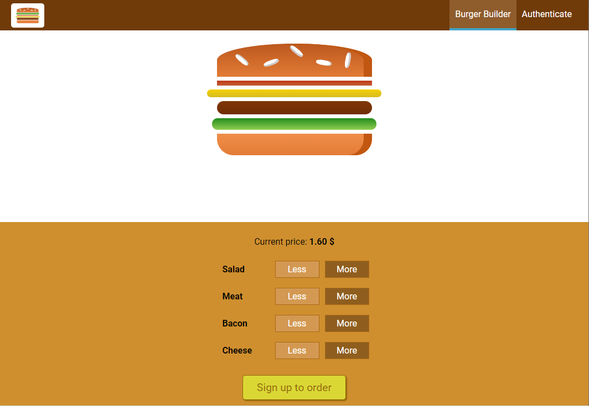

<br />
<p align="center">
  <a href="/">
    
  </a>

  <h3 align="center">Burger builder</h3>

  <p align="center">
    An awesome Burger builder project using React+Redux!
    <br />
    <br />
  </p>
</p>


<!-- TABLE OF CONTENTS -->
<details open="open">
  <summary>Table of Contents</summary>
  <ol>
    <li>
      <a href="#getting-started">Getting Started</a>
      <ul>
        <li><a href="#installation">Installation</a></li>
      </ul>
    </li>
    <li><a href="#contact">Contact</a></li>
  </ol>
</details>


<!-- ABOUT THE PROJECT -->
## About The Project

<div style="margin-left: 20%">
    
</div>


## Frameworks and libraries

The list of major frameworks and third-party libraries used in project :

* [React.js](https://reactjs.org/)
* [Redux](https://redux.js.org/)
* [Redux-thunk](https://github.com/reduxjs/redux-thunk)
* [Axios](https://github.com/axios/axios)


## Getting Started

### Installation

1. Install NPM packages
   ```sh
   npm install
   ```
2. Run the app in the development mode [http://localhost:3000](http://localhost:3000) 
   ```sh
   npm start
   ```
3. Build the app for production to the `build` folder.<br />

   ```sh
   npm run build
   ```

It correctly bundles React in production mode and optimizes the build for the best performance.
<br/>

See the section about [deployment](https://facebook.github.io/create-react-app/docs/deployment) for more information. <br/>


## Contact

LinkedIn - [Meruzhan Kiloyan](https://www.linkedin.com/in/meruzh-kiloyan-05327917b/)

Project Link on the Firebase hosting: [https://burger-builder-9d1db.firebaseapp.com/](https://burger-builder-9d1db.firebaseapp.com/)


